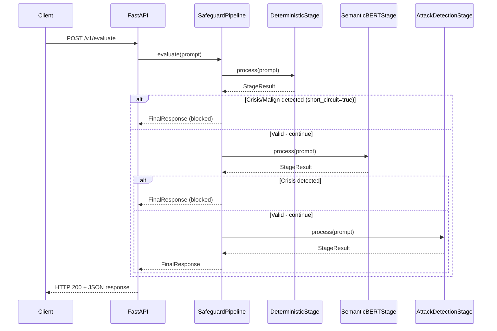

# Clinical Safeguards

[](https://www.python.org/downloads/)
[](https://fastapi.tiangolo.com/)
[](https://opensource.org/licenses/MIT)
[]()
[]()

A production-ready safeguard middleware for clinical LLM applications. Implements a multi-stage pipeline to detect
crisis situations, malicious prompts, and prompt injection attacks before they reach your LLM.

## Table of Contents

- [Features](#features)
- [Quick Start](#quick-start)
- [Architecture](#architecture)
- [Pipeline Stages](#pipeline-stages)
- [API Reference](#api-reference)
- [Configuration](#configuration)
- [Development](#development)
- [Contributing](#contributing)
- [License](#license)

## Features

- **Multi-stage Pipeline**: Sequential execution with short-circuit on detection
- **Crisis Detection**: C-SSRS-based keyword detection for mental health emergencies
- **Malicious Content Filtering**: Detection of harmful requests and policy violations
- **Prompt Injection Defense**: Semantic detection using fine-tuned DeBERTa model
- **Fail-Closed Design**: Any unhandled error returns a safe Server Error response
- **Zero Prompt Leakage**: Original prompt text never included in error responses
- **Configurable Stages**: Hydra-based configuration for flexible pipeline composition

## Quick Start

### Prerequisites

- Python 3.12+
- [uv](https://github.com/astral-sh/uv) package manager
- HuggingFace token (for semantic stages)

### Installation

```bash
# Clone the repository
git clone https://github.com/JMasr/clinical-safeguard.git
cd clinical-safeguard

# Create virtual environment and install dependencies
make create_environment
source .venv/bin/activate
make requirements
```

### Configuration

Create a `.env` file in the project root:

```bash
HF_TOKEN=hf_your_huggingface_token_here
SAFEGUARD_TIMEOUT=10
```

### Running the Service

```bash
# Development (deterministic stage only, no models)
python main.py pipeline=default

# Production with clinical BERT
python main.py pipeline=clinical

# Full stack (BERT + attack detection)
python main.py pipeline=full

# Using uvicorn directly
uvicorn main:app --reload --host 0.0.0.0 --port 8000
```

### Quick Test

```bash
curl -X POST http://localhost:8000/v1/evaluate \
  -H "Content-Type: application/json" \
  -d '{"text": "What are healthy coping strategies for anxiety?"}'
```

## Architecture

### Pipeline Flow



### Module Structure

```
src/
├── core/
│   ├── pipeline.py          # SafeguardPipeline — orchestrator
│   ├── base.py              # GuardrailStage ABC
│   └── exceptions.py        # Exception hierarchy
├── stages/
│   ├── deterministic.py     # Keyword + regex matching
│   ├── semantic.py          # Clinical BERT classifier
│   └── attack_detection.py  # Prompt injection detector
├── models/
│   ├── request.py           # PromptInput
│   ├── response.py          # StageResult, FinalResponse
│   └── enums.py             # Label, ResponseCode
├── config/
│   └── settings.py          # Environment settings
├── api/
│   ├── app.py               # FastAPI app factory
│   ├── router.py            # /v1/evaluate, /health
│   └── inspect_router.py    # /v1/inspect (debug)
└── resources/
    ├── keywords_crisis.yaml
    ├── keywords_malign.yaml
    └── bypass_patterns.yaml
```

### Class Diagram

```
                    ┌──────────────────────────┐
                    │    GuardrailStage (ABC)  │
                    │──────────────────────────│
                    │ + name: str              │
                    │ + process(PromptInput)   │
                    │   -> StageResult         │
                    └────────────┬─────────────┘
                                 │
        ┌────────────────────────┼────────────────────────┐
        │                        │                        │
        ▼                        ▼                        ▼
┌───────────────────┐  ┌─────────────────────┐  ┌─────────────────────┐
│ DeterministicStage│  │  SemanticBERTStage  │  │AttackDetectionStage │
│───────────────────│  │─────────────────────│  │─────────────────────│
│ FlashText keywords│  │ HuggingFace pipeline│  │ DeBERTa classifier  │
│ Regex patterns    │  │ Lazy model loading  │  │ Injection detection │
│ O(n) matching     │  │ Thread-safe init    │  │ Inherits Semantic   │
└───────────────────┘  └─────────────────────┘  └─────────────────────┘

                    ┌──────────────────────────┐
                    │    SafeguardPipeline     │
                    │──────────────────────────│
                    │ + evaluate(PromptInput)  │
                    │   -> FinalResponse       │
                    │ + evaluate_with_trace()  │
                    │   -> PipelineTrace       │
                    └──────────────────────────┘
```

## Pipeline Stages

### 1. DeterministicStage

Fast keyword and pattern matching using FlashText (Aho-Corasick algorithm, O(n) complexity).

**Detection hierarchy:**

1. Bypass patterns (prompt injection attempts) → `Malign`
2. Crisis keywords (C-SSRS categories) → `Crisis`
3. Malicious keywords → `Malign`
4. No match → `Valid`

**Resources:**

- `keywords_crisis.yaml`: 7 categories mapped to C-SSRS severity levels
- `keywords_malign.yaml`: Harmful content patterns
- `bypass_patterns.yaml`: 12 regex patterns for injection detection

### 2. SemanticBERTStage

Clinical text classification using HuggingFace transformers.

**Model:** `mental/mental-bert-base-uncased`

- Fine-tuned on mental health crisis datasets
- Detects semantic indicators of crisis situations

**Design features:**

- Lazy loading with double-checked locking
- Injectable pipeline factory for testing
- Configurable confidence threshold
- Timeout protection via daemon threads

### 3. AttackDetectionStage

Semantic prompt injection detection using fine-tuned DeBERTa.

**Model:** `ProtectAI/deberta-v3-base-prompt-injection-v2`

- 0.2B parameters
- Apache 2.0 license
- Trained on 7+ security datasets

**Labels:**

- `SAFE` → Valid
- `INJECTION` → Malign (not Crisis)

## API Reference

### POST /v1/evaluate

Evaluate a user prompt through the safeguard pipeline.

**Request:**

```json
{
  "text": "User prompt text (1-8192 chars)",
  "session_id": "optional-session-id"
}
```

**Response:**

```json
{
  "code": 100,
  "label": "Valid",
  "data": {
    "processed_text": "User prompt text",
    "confidence_score": 0.99,
    "metadata": {
      "stage": "deterministic",
      "triggered_by": null
    }
  }
}
```

**Response Codes:**

| Code | Label        | Description                          |
|------|--------------|--------------------------------------|
| 100  | Valid        | Prompt is safe to process            |
| 400  | Malign       | Malicious or policy-violating prompt |
| 406  | Crisis       | Mental health crisis detected        |
| 500  | Server Error | System error (fail-closed)           |

> **Note:** HTTP status is always 200. Business logic codes are in the JSON body to prevent retry loops on blocked
> prompts.

### GET /health

Health check endpoint.

**Response:**

```json
{
  "status": "ok",
  "pipeline": {
    "stages": [
      "deterministic",
      "semantic_bert",
      "attack_detection"
    ],
    "stage_count": 3,
    "inspect_mode": false
  }
}
```

### POST /v1/inspect

Debug endpoint (requires `SAFEGUARD_INSPECT_MODE=true`).

Returns full pipeline trace with per-stage timing.

## Configuration

### Pipeline Profiles

Located in `conf/pipeline/`:

**default.yaml** — Deterministic only (no models)

```yaml
stages:
  - _target_: src.stages.deterministic.DeterministicStage
    keywords_crisis_path: ${paths.crisis}
    keywords_malign_path: ${paths.malign}
    bypass_patterns_path: ${paths.bypass}
```

**clinical.yaml** — Deterministic + Clinical BERT

```yaml
stages:
  - _target_: src.stages.deterministic.DeterministicStage
    # ... paths ...
  - _target_: src.stages.semantic.SemanticBERTStage
    model_id: mental/mental-bert-base-uncased
    threshold: 0.75
    inference_timeout_s: 10
```

**full.yaml** — All three stages

```yaml
stages:
  - _target_: src.stages.deterministic.DeterministicStage
    # ... paths ...
  - _target_: src.stages.semantic.SemanticBERTStage
    model_id: mental/mental-bert-base-uncased
    threshold: 0.75
    inference_timeout_s: 10
  - _target_: src.stages.attack_detection.AttackDetectionStage
    model_id: ProtectAI/deberta-v3-base-prompt-injection-v2
    threshold: 0.75
    inference_timeout_s: 10
```

### Environment Variables

| Variable                 | Default | Description                 |
|--------------------------|---------|-----------------------------|
| `HF_TOKEN`               | —       | HuggingFace API token       |
| `SAFEGUARD_TIMEOUT`      | 10      | Inference timeout (seconds) |
| `SAFEGUARD_INSPECT_MODE` | false   | Enable /v1/inspect endpoint |

### CLI Overrides

```bash
# Change pipeline profile
python main.py pipeline=clinical

# Override specific parameters
python main.py pipeline=full pipeline.stages.1.threshold=0.9

# Override resource paths
python main.py paths.crisis=/custom/path/keywords.yaml
```

## Development

### Setup

```bash
make create_environment
source .venv/bin/activate
make requirements
```

### Running Tests

```bash
make test

# With verbose output
python -m pytest tests/ -v

# Specific test file
python -m pytest tests/test_pipeline.py -v
```

### Code Quality

```bash
# Lint
make lint

# Format
make format
```

### Project Commands

```bash
make help  # Show all available commands
```

## Design Decisions

### HTTP 200 Always

All business codes (100/400/406/500) are returned in the JSON body, never as HTTP status codes. This prevents automatic
retry mechanisms from re-submitting blocked prompts.

### Fail-Fast Startup

If resources fail to load at startup, the service does not start. A security service that cannot guarantee its integrity
must not accept traffic.

### Label Precedence

When multiple stages complete without short-circuit:

```
Crisis > Malign > Server Error > Valid
```

### Short-Circuit Behavior

- `Crisis` or `Malign` detection → Pipeline stops immediately
- `Valid` → Continue to next stage
- Any exception → `Server Error` (fail-closed)

## Contributing

See [CONTRIBUTING.md](CONTRIBUTING.md) for guidelines on:

- Adding new pipeline stages
- Extending keyword resources
- Testing requirements

## License

MIT License — see [LICENSE](LICENSE) for details.

## References

- [C-SSRS](https://cssrs.columbia.edu) — Columbia-Suicide Severity Rating Scale
- [OWASP LLM Top 10](https://owasp.org/www-project-top-10-for-large-language-model-applications/) — LLM01: Prompt
  Injection
- [mental-bert](https://arxiv.org/abs/2110.15621) — Mental Health BERT paper
- [ProtectAI](https://huggingface.co/ProtectAI/deberta-v3-base-prompt-injection-v2) — Prompt injection detection model

